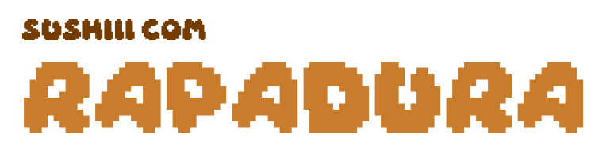

# Sushiiii com Rapadura

## O Jogo

**Sushiiii com Rapadura** é um jogo desenvolvido durante uma game jam de 48 horas. Nele, você controla uma cobrinha determinada a encontrar seu prato favorito: **sushi com rapadura**!  
Em sua jornada pela estrada, ela segue ao som da contagiante música *Sushi com Rapadura*, enfrentando obstáculos e desafios no caminho.

**Tema da Game Jam:** "Olha a cobra" (festa junina)

**Duração da Game Jam:** 48 horas

**Ferramentas Utilizadas:** Godot
 

## Como Jogar

- **Controles:**  
  - [Seta Direita]: Mover para a direita  
  - [Seta Esquerda]: Mover para a esquerda  
  - [Seta Cima]: Mover para cima  
  - [Seta Baixo]: Mover para baixo

- **Objetivo:**  
   Viaje em busca do seu sushi com rapadura enquanto evita os perigos pelo caminho
## Instalação 

Você pode baixar os executáveis na aba [Releases](https://github.com/lorh4n/GanaJam/releases).
E também temos ele no [itch.io](https://ana-hidalgo.itch.io/sushiii-com-rapadura)

<!-- ## Capturas de Tela
 -->

## Equipe

* [@AnaBeatrizHidalgo](https://github.com/AnaBeatrizHidalgo)
* [@FelipePM01](https://github.com/FelipePM01)
* [@lorh4n](https://github.com/lorh4n)

## Créditos

Os créditos dos assets utilizados estão no arquivo `creditos.txt`.

## Licença

Este jogo foi criado exclusivamente para uma game jam, sem fins comerciais.
